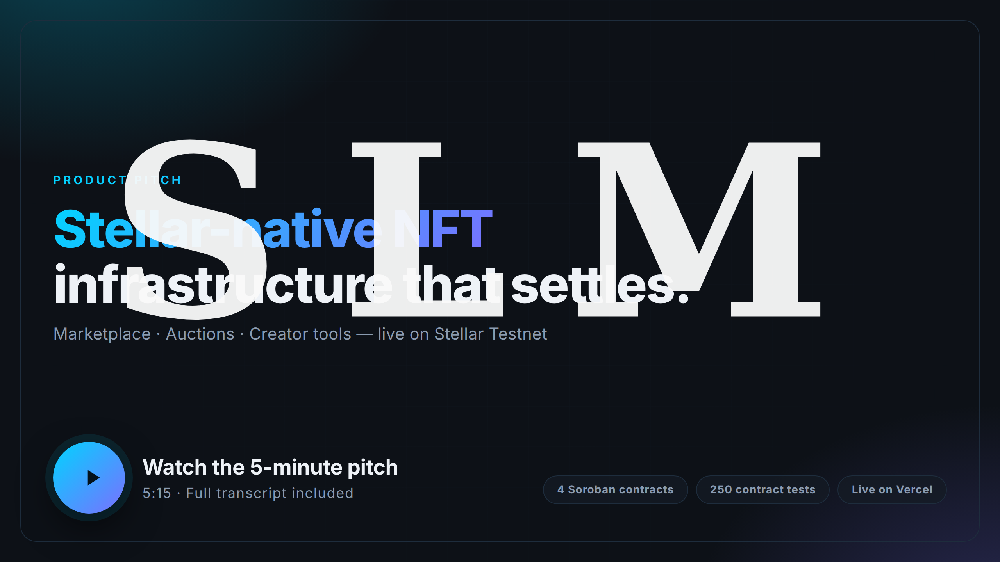

# LumenMint pitch video

The project's primary presentation: a five-minute product pitch that
explains the problem, the product, the architecture, the live deployment and the
engineering behind it.

**[▶ Watch the pitch](./out/stellar-lumenmint-pitch.mp4)** · 5:15 · 1080p30 · AAC

[](./out/stellar-lumenmint-pitch.mp4)

---

## Why this is generated, not edited

The video is produced by a small, checked-in pipeline rather than cut by hand in
an editor. That is a deliberate engineering choice, and it is the reason the
pitch can be trusted:

- **Every number on screen comes from the repository.** The gas table is read
  from benchmark output, the code excerpt is sliced out of
  `settlement_core.rs` at render time, and the test counts match CI. A
  hand-edited video drifts from the code the moment the code changes; this one
  is re-rendered from it.
- **Every screenshot is of the running product.** The product shots are captured
  from the live Vercel deployment, not mocked up.
- **The narration is the clock.** Each scene's visuals are sized to that scene's
  audio, so the voice and the pictures cannot drift apart.

## Pipeline

```
  scenes.mjs ─┬─▶ capture.mjs ──▶ assets/*.png ──┐
              │   slides.mjs                    │
              │                                 ├─▶ assemble.mjs ──▶ out/*.mp4
              └─▶ narrate.mjs ──▶ audio/*.mp3 ──┘         │
                                                         ├─▶ thumbnail.mjs  ──▶ out/thumbnail.png
  scenes.mjs + narration.json ──▶ transcript.mjs ────────┴─▶ transcript     ──▶ out/TRANSCRIPT.md
                                          out/* ──▶ verify-video.mjs
```

| Stage | Script | Output |
|---|---|---|
| Capture | `capture.mjs` | Renders the brand slides and screenshots the live site into `assets/`, plus `manifest.json` |
| Narrate | `narrate.mjs` | One MP3 per scene into `audio/`, plus `narration.json` |
| Assemble | `assemble.mjs` | Crossfades each scene's shots and concatenates into `out/stellar-lumenmint-pitch.mp4` |
| Thumbnail | `thumbnail.mjs` | `out/thumbnail.png`, used by the README |
| Transcript | `transcript.mjs` | `out/TRANSCRIPT.md`, with a timestamp per chapter |
| Verify | `verify-video.mjs` | Checks the committed artifacts and the README links; exits non-zero on failure |

`scenes.mjs` is the single source of truth for the script, the shot list and the
narrative structure. `timing.mjs` holds the shot-allocation arithmetic that both
the renderer and the transcript depend on, so the two cannot disagree about when
a chapter starts. Editing `scenes.mjs` and re-running `npm run build` rebuilds
everything consistently.

## Reproducing it

Requirements: **Node 20+**, **ffmpeg** with `libx264`, `libass` and `drawtext`,
**Python 3** with `edge-tts`, and **Inter** installed as a system font.

```bash
# one-time setup
npm install
npx playwright install --with-deps chromium
pip install edge-tts
sudo apt-get install -y ffmpeg fonts-inter

# build the whole thing
npm run build

# or one stage at a time
npm run capture     # slides + live-deployment screenshots
npm run narrate     # voice-over
npm run assemble    # render the video
npm run thumbnail   # README thumbnail
npm run transcript  # chapter-timestamped transcript
npm run verify      # check the committed artifacts and README links
```

`npm run capture` screenshots the deployment at `SITE_URL`, defaulting to the
production Vercel URL. Point it at a preview to pitch a branch:

```bash
SITE_URL=https://your-preview.vercel.app npm run capture
```

The voice, pace and pitch are overridable without editing code — useful for
regenerating the narration in a different voice:

```bash
TTS_VOICE=en-GB-SoniaNeural TTS_RATE=+0% npm run narrate
```

## Design notes

**Scenes are rendered independently and then concatenated.** Crossfades inside a
scene consume time, so shots are allocated the target duration *plus* the
overlap; rendering each scene to its own narration length and concatenating
keeps every scene's audio starting at its own zero. A single global crossfade
chain would shift every later scene's soundtrack by the accumulated overlap.

**Motion is chosen per shot.** A tall page scrolls, because a still screenshot of
a long page reads as a photograph rather than a screen. A full-frame slide pushes
in slowly, so it does not look frozen.

**Only working pages are filmed.** `capture.mjs` refuses to screenshot a route
that renders an error state and records the exclusion in `manifest.json`. A
broken screen in a product pitch is worse than a missing one. Two marketplace
routes are currently excluded this way because the deployed frontend cannot reach
its API — tracked in [#71](https://github.com/Stellar-LumenMint/Stellar-LumenMint/issues/71).
Re-enable them and re-render once that lands.

**Deliverables in `out/` are committed** so the README can link to them directly;
everything in `assets/`, `audio/` and `.work/` is regenerated by `npm run build`
and is ignored by git.

**The transcript is generated from `scenes.mjs`, not from `manifest.json`.** The
manifest is a capture-time snapshot: edit the script after capturing and its copy
of the narration goes stale, which would produce a transcript that silently omits
whatever was added — while the audio, regenerated from the script, still says it.
The script is the source of truth for what is spoken; only the timing comes from
the recorded narration.

**`npm run verify` is the safety net for all of the above.** It is the only thing
that catches a truncated render, a thumbnail at the wrong resolution, or a README
pointing at a file that was renamed — failures that are invisible in a diff and
invisible on the rendered page.
